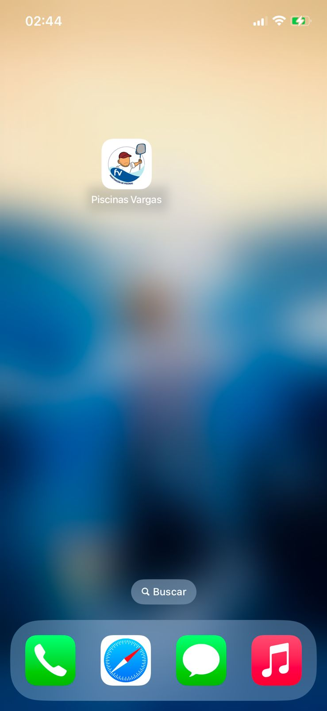
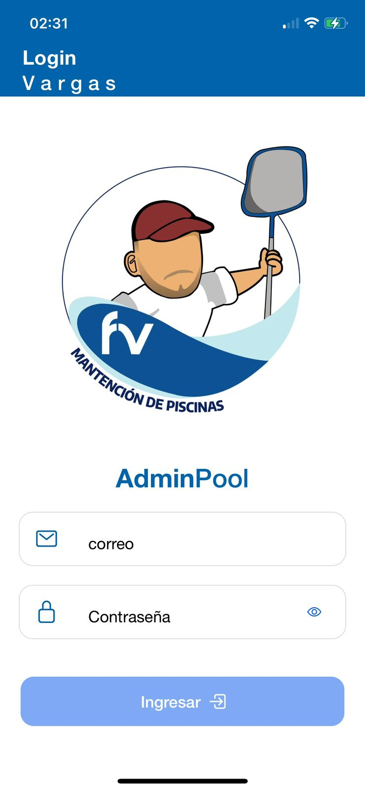

# Aplicación de Mantención de piscinas

## problematica : 

La problematica de nuestro cliente  era que sus clientes a veces cuando el realizaba una mantencion de una piscina, le decian que no paso a realizar la mantencion
ese era su principal problematica y no tenia un respaldo para poder decirle al cliente de que si realizo la mantencion. a continuacion veran una aplicacion desarrollada en ionic , angular con firebase y microservicio de java para gestion de correos electronicos a los clientes usando javamail con springboot 

# aplicación

### paso 1 :

Aqui creamos una acceso directo desde la pagina web para que quede como aplicacion mobile y seleccionamos la aplicacion 

### paso 2 :

