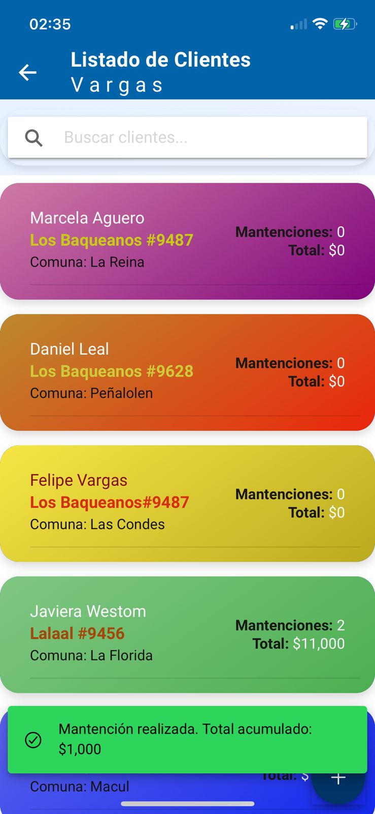

# Aplicación de Mantención de piscinas

## Problemática : 

Nuestro cliente enfrentaba un problema recurrente: al realizar el mantenimiento de una piscina, algunos clientes afirmaban que dicho mantenimiento no se había llevado a cabo. Esta situación generaba conflictos y desacuerdos, ya que el cliente no disponía de un respaldo para demostrar que el servicio había sido efectivamente realizado.

Con el objetivo de resolver esta problemática, desarrollamos una aplicación basada en Ionic y Angular, con una integración de Firebase para la gestión de datos. Además, implementamos un microservicio en Java con Spring Boot que utiliza JavaMail para enviar correos electrónicos automáticamente a los clientes, notificándoles cada vez que se realiza una mantención.

# Aplicación

### Paso 1: Instalación como Aplicación Móvil 

Desde la página web, ofrecemos la opción de crear un acceso directo para que la aplicación funcione como una aplicación móvil. Una vez instalada, se puede acceder directamente seleccionándola desde la pantalla de inicio.

### Paso 2: Inicio de Sesión

Para acceder al menú principal de la aplicación, es necesario ingresar el correo electrónico y la contraseña del usuario.

### Paso 3: Acceso a la Lista de Clientes

Una vez dentro del menú principal, se puede navegar al apartado de "Clientes" para visualizar todos los clientes registrados.

### Paso 4: Gestor de Clientes

En esta sección, es posible:

- Ver los clientes existentes.

- Agregar nuevos clientes.

- Identificar clientes mediante tarjetas clasificadas por colores según la comuna.

Además, contamos con un buscador en la parte superior para facilitar la localización de clientes. Para agregar un nuevo cliente, simplemente pulsamos el botón + ubicado en la esquina inferior derecha. Esto abre un modal que contiene un formulario de registro.

### Paso 5: Registro de Mantención

Desde el modal de registro, se pueden realizar las siguientes acciones:

- Registrar el precio de la mantención.

- Agregar una descripción opcional del trabajo realizado.

- Adjuntar una imagen como evidencia de algún cambio realizado, como el reemplazo de un filtro u otro servicio.

Al seleccionar "Aplicar Mantención", se enviará automáticamente un correo electrónico al cliente notificándole que la mantención ha sido realizada.

### Paso 6: Edición de Datos de Cliente

Es posible editar los datos de un cliente registrado, incluyendo su información personal y el historial de mantenciones.

### Paso 7: Confirmación de Mantención

Al completar una mantención, la aplicación actualiza el total acumulado y notifica el éxito del envío del correo al cliente.

## Solución Implementada

Con esta aplicación, logramos resolver la problemática planteada. Ahora, el cliente cuenta con un respaldo que evidencia las mantenciones realizadas, mejorando la comunicación y la confianza con sus usuarios.

El frontend de la aplicación está alojado en Firebase Hosting, mientras que el backend de microservicio para la gestión de correos electrónicos está implementado en Render.

